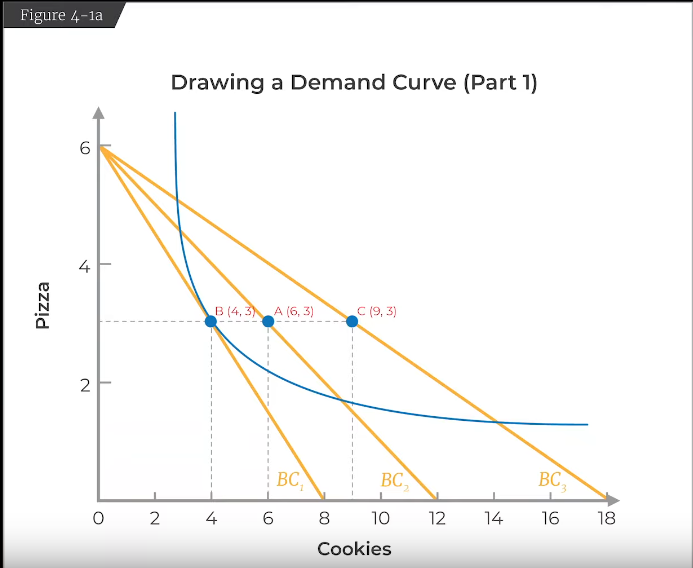
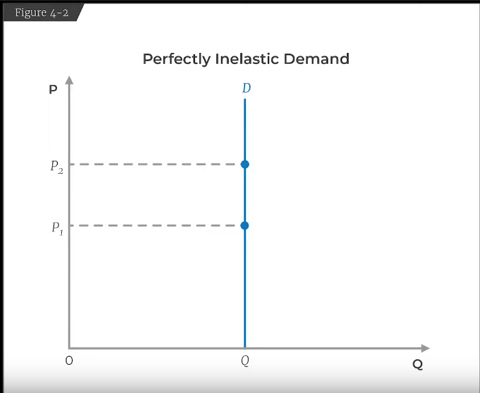
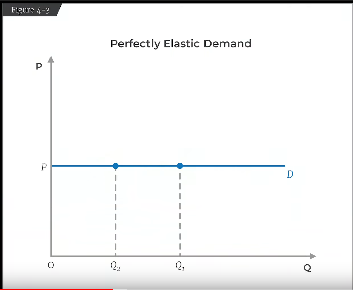

## Supply and demand 
- Adam Smith noted the diamon and water paradox 
- We can't predict price from demand along 
- We need the supply as well 
- The  intersection of demand and supply curve gives us the equilibrium price 

## Positive v/s Normative analysis 
Positive analysis  is what things are 
Normative analysis is what they should be. 

## Market Failures
When the market doesn't work th way economists think so. Things like fraud or imperfect information. 

## Equity / Fairness
Should only rich people get Kidneys? Probably not the best optimization 

## Behavioral Economics
- Econs are not real 
- Behavioral economics is about understanding what kind of deviations people make from econs.

# Core of capitalism 
- individuals making decisions for their own best interests lead to what's best of the economy 

Note: for now we're gonna define the best interests of the society as the maximum number of goods produced and consumed and we're not gonna worry about things like polution and health. 

## Competitive markets

Competitive markets are simply those markets where we have a bunch of buyers and a bunch of sellers.

# The Demand curve 
We want to derive the demand curve: it comes from how consumers make choices 

We care about
- preferences 
- utility 

The current model we'll talk about is that of utility maximization 
## Utility maximization 
- preferences 
- Budget constraint 

We want to map people's preferences and then we want to make a mathematical model of utility (without concerns of resources)

### Preference assumptions
- **Completeness**: the assumption is that you always have a preference in a set, you can rate two things in the same manner, but you can't just say idk. 
- __Transitivity__: if you like A better than B and B better than C then A is better than C
- __Non-Satiation__: We always want more 

We're gonna graph people's preferences using indeffirence maps.

consider a 2-D decision case, you have two choose among pizzas and cookies, the options are as follows:
1. 2 Pizza, 1 cookies
2. 1 pizza, 2 cookies
3. 2 pizzas, 2 cookies 

We assume that $1=2$ in preference and we assume $3$ is greater than the rest because of the non-satiation assumption 

Note: if two options are the same to us in preference, then we say that we're indifferent to them. An indifference curves basically tells us that all points on that curve have the same preference and that we are indifferent to what is picked among them. 

Indifferences curves will have to follow 4 properties:
1. Consumers prefer _higher_ indifference curves (comes from the non-satiation assumption)
2. Indifference curves _never_ cross. The crossing violates transitivity.
3. Indifference curves are downward sloping (comes from non-satiation). If the slope is positive then different point may be more preferable objectively (by quantiity). 
4. There is only one indifference curve through the same bundle. 

Now we wanna go from indifference curves to utility functions for a more mathematical representation of what your preferences are. 

suppose your utility function is $U = \sqrt{p \times c}$ where $p$ is the numebr of pizzas and $c$ is the number of cookies. And this utility function works with our given example for now. 

Utility is not a cardinal concept, it is an ordinal concept, i.e. utilities can be ranked and don't have an absolute value associated with them (at times we're gonna assume that they do) 

Now, uderstand something, if your bundles only consisted of one type of element then it's very simple, we can just apply non-satiation principle and simply rank by quantity of that one object. Shit gets complicated when you have multiple dimensions and the utility function is what allows us to combine the whole thing into one number.

__marginal utility__: can be considered the derivative of the utility function with respect to one of the components. 

It is important to note the our utility functions must acommodate a diminishing marginal utility, i.e. the more of a good you have, the less you would like more of it.

as you can see, the slope of the graph reduces gradually towards the right. 

So, it says that each new quantity makes you feel better off, but less and less so.

Note: marginal utility can't be negative, so utility doesn't decrease due to the principle of non-satiation. 

Utility is an ordinal concept, so we can always make functions that take negative values. 

The slope of the indifference curve is the __marginal rate of substitution__ i.e. the rate at which you're willing to substitute one for the other.
We define that as $$MRS = \frac{\Delta P}{\Delta C}$ where $P$ is the quantity of pizza and $C$ is the quantity of cookies

__MRS is ALWAYS diminishing__ 
so at point A, MRS tells you that you're willing to substitute 2 units of pizza for one unit of cookies but at point B (to point C) you're only willing to substitue 1 unit of pizza for 2 cookies

MRS is always diminishing due to the general non-satiation principle 

Now: DEFINITION TIME BITCHEs

I have an arbitrary bi-variable utility function $U(P, C)$ 
then

$$
dU = \frac{\delta U}{\delta P} dP + \frac{\delta U}{\delta C} dC
$$

Now, in the indifference curve, $dU = 0$ 

and thus we have 
$$
\frac{\delta U}{\delta P} dP + \frac{\delta U}{\delta C} dC = 0
$$

$$
\Rightarrow \frac{\delta U}{\delta P} dP = -\frac{\delta U}{\delta C} dC 
$$

$$
\Rightarrow \frac{dP}{dC} = \frac{-\frac{\delta U}{\delta C}}{\frac{\delta U}{\delta P}}
$$

Note that by $\frac{\delta U}{\delta C} = M U_C$ is basically the marginal utility of cookies and $\frac{\delta U}{\delta P} = M U_P$ is the marginal utilities of pizzas

and therefore that leads us to.

$$
MRS = \frac{\Delta P}{\Delta C} = \frac{- M U_C}{M U_P}
$$

The curve is non-concanve

(I'll do a bit of maths on this)

Now, you might thing that the law of marginal utility doesn't work with addictive good like cigarettes. The prof says that the better model for addictive things is that the utility curve keeps shifting as you get more addicted. 

So in a particular day you're feeling crappy, the first cigarette still does more for you than the second one, but the next day your utility function has shifted. 

# Budget constraints
We use a simplifying assumption that income = budget. 
(basically no savings)

suppose you resources are $Y$ 
now, you need to spend all your money on either pizza or cookie

giving us $Y = p_P \cdot P + p_C \cdot C$ where the $p$'s are the respective prices.
Since $Y$ is a constant we'll get a straight line.  

Now we introduce a new concept called the marginal rate of transformation or MRT

$slope = MRT = \frac{-p_C}{p_P}$ 

it's basically saying that the rate of transforming one of them into the other, each pizza can be exchanged for that amount of cookies given the same budget constraints. That can also be said to be the opportunity cost: cost of the next best alternative.

We had already established that _higher_ the indifference curve, the better off we are, so we want to keep moving our indifference curve till we are exactly tangent to the budge line and that will be our optimum consumption. 

Note at the optimum consumption due to tangency, the slope of the indifference curve will be equal to the budget line or in other words, the marginal rate of transformation will be equal to marginal rate of substitution.

$$
MRT = \frac{-p_C}{p_P} = MRS = \frac{\Delta P}{\Delta C} = \frac{- M U_C}{M U_P}
$$

which we can also re-write as 

$\frac{MU_C}{p_C} = \frac{MU_P}{p_P}$  this is our optimum 

# Deriving demand curves 
Now we want the relation ship of quantity demanded and price. 

Suppose, we know the following:

$U = \sqrt{P \times C}$ 
$Y = \$ 72$ 
$p_P = \$12$
$p_C = \$6$

understand that due to changes of price the indifference curves aren't changing. The indifference curve you end up choosing is what changes. 

Now, we change the price of cookies and find the points of tangency and record the quantity of  cookies at the point of tangency. We plot all these quantities against the price and et voila we have a demand curve. 

Note something about this particular utility function we have chose, it is such that demand of a good depends __only__ on your preference, income, and it's price, but that is not the case in general.

# Elesticity of demand 
We define it as:

$$
\epsilon = \frac{\frac{\Delta Q}{Q}}{\frac{\Delta P}{P}}
$$
in words: fractional change in quantity demanded diviided by the fractional change in price. 

Note: since the curve is downward sloping $\epsilon \leq 0$ 

## Perfectly inelastic $\epsilon=0$
There are no extremes in the real world but we come close. So something like insulin would be perfectly inelastic 

## Perfectly elastic $\epsilon \rightarrow -\infty$ 
Whenever you have perfect substitutes. 

So it implies that that the price can't change 

__Note: in general the more substitutable a product is the more elstic it's demand__ 

## Generating an engel curve

Engel curve is the relation between income and quantity demanded

The slope of the Engel curve is the income elasticity 
$$
\gamma = \frac{\frac{\delta Q}{Q}}{\frac{\delta y}{y}}
$$
replace Q term with $Q_0$ and Y term with $Y_0$ in case of 

$$
\gamma > 0
$$
for a normal good 

The meaning of __inferior__ is goods is:
$$
\gamma < 0
$$

which implies that __inferior__ goods are goods that you'd demand less of as your income __increaseS__

A valid example of this is fast food. Fast food is generally bad for you, the more money you have the less you'll probably demand it 

The classic example is potatoes.

To some extent this has to do with substitutibility 

Now, we're have to talk about necessities v/s necessity

so we can say 
$$
\gamma > 1
$$
 for luxury goods, the more income you have the more you demand them (and vice versa)

and for necessity goods we have
$$
\gamma < 1
$$

# Effects of price changes (deep theory)

We're gonna divide the whole decision-making into two parts

- Substitution effect
- Income changes

